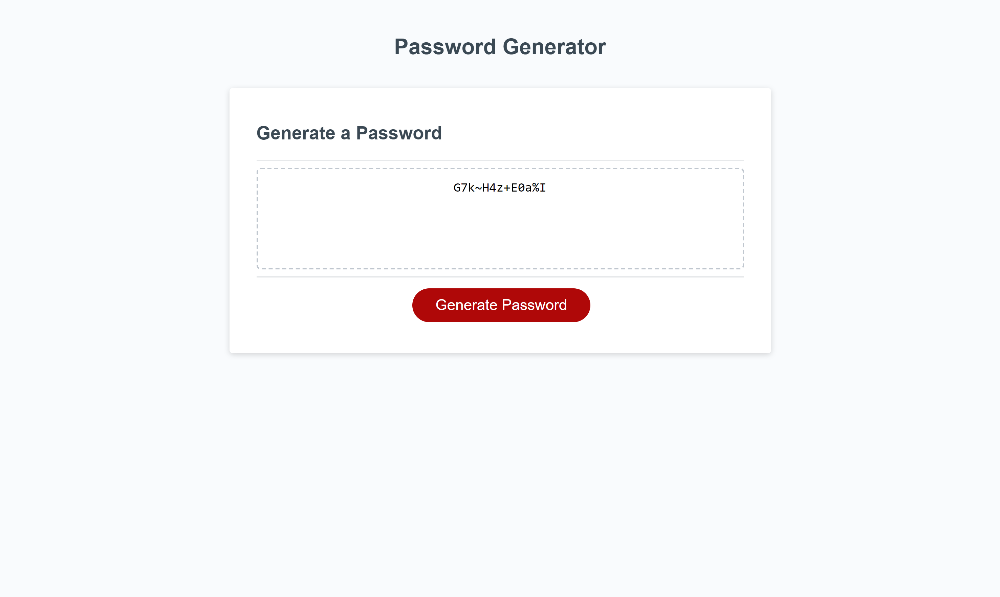

# module3chal
## Description

I contributed to this project to work within the parameters set by the instructors with given code, while adding more code in javascript. Hopefully this solves any issues with passwords not being secure enough. I learned that a button can call a function in multiple ways, and I learned how a variable gets referenced in another file.

## Installation

Open the index.html file and a new window should pop up

## Usage
  
  

Enter how many characters you want your password to be, 8-24 characters. Confirm yes or no for special characters, numbers, uppercase letters, and lowercase letters.

## Credits

Someone from the course made most of the code in the .html, .css, and .js files.

## License

MIT License

Copyright (c) [2023] [Edward Chang]

Permission is hereby granted, free of charge, to any person obtaining a copy
of this software and associated documentation files (the "Software"), to deal
in the Software without restriction, including without limitation the rights
to use, copy, modify, merge, publish, distribute, sublicense, and/or sell
copies of the Software, and to permit persons to whom the Software is
furnished to do so, subject to the following conditions:

The above copyright notice and this permission notice shall be included in all
copies or substantial portions of the Software.

THE SOFTWARE IS PROVIDED "AS IS", WITHOUT WARRANTY OF ANY KIND, EXPRESS OR
IMPLIED, INCLUDING BUT NOT LIMITED TO THE WARRANTIES OF MERCHANTABILITY,
FITNESS FOR A PARTICULAR PURPOSE AND NONINFRINGEMENT. IN NO EVENT SHALL THE
AUTHORS OR COPYRIGHT HOLDERS BE LIABLE FOR ANY CLAIM, DAMAGES OR OTHER
LIABILITY, WHETHER IN AN ACTION OF CONTRACT, TORT OR OTHERWISE, ARISING FROM,
OUT OF OR IN CONNECTION WITH THE SOFTWARE OR THE USE OR OTHER DEALINGS IN THE
SOFTWARE.

